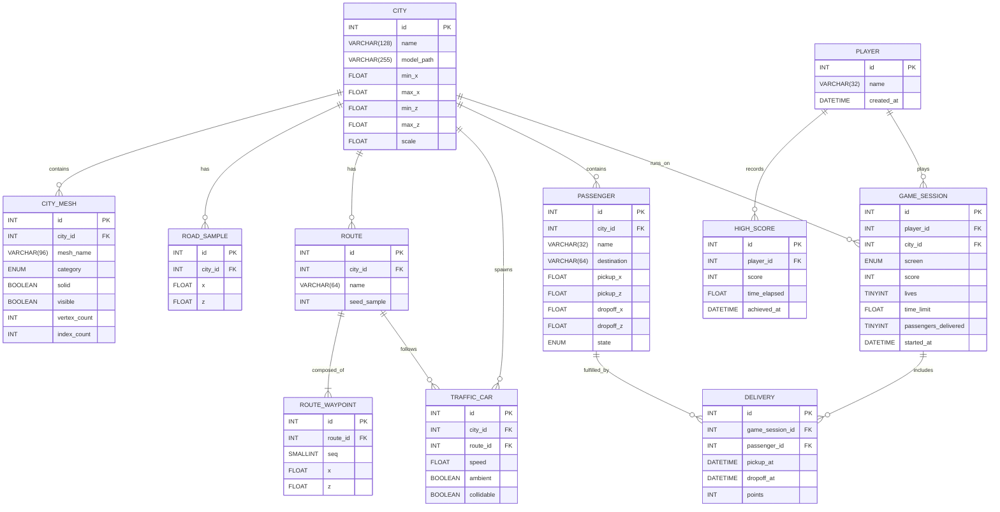

# City Racer — Rating & MariaDB Design Diagram

## Quick Facts

| Metric | Value |
|---|---|
| Language / Stack | Java 26, LWJGL 3 (GLFW, OpenGL 3.3, Assimp, STB), JOML |
| Source lines (Java) | 5,627 lines across 28 files |
| Biggest file | `Main.java` — 1,770 lines (31% of the codebase) |
| Total decision points (`if/for/while/switch/case`) | ~519 |
| Tests | 0 |
| Assets | 4 GLB models, ~80 MB (no verified licenses for most) |
| Persistence today | plain-text `scoreboard.txt` (CSV) |

## Scorecard (out of 10)

| Category | Score | Notes |
|---|---|---|
| Documentation | 9.0 | Excellent README (architecture, tuning table, troubleshooting) + OOP guide |
| Robustness | 7.5 | Graceful fallbacks for models/fonts, delta-time capping, crash cooldown, defensive null checks |
| Code quality / OOP | 7.0 | Clean packages, `GameObject`→`Entity`, `Updatable`/`Renderable`, Passenger state machine; but `Main` is a god class |
| Gameplay & fun | 6.0 | Solid arcade loop (pickup → drop-off → avoid traffic); shallow, no difficulty curve |
| Performance | 6.0 | Road-height spatial grid index; but no frustum culling, per-triangle route tracing |
| Maintainability | 5.5 | Readable, well-named; zero tests, `Main` does everything, duplicated `ScoreEntry`/`ScoreboardManager` aliases |
| Visual polish | 5.5 | Custom renderer with lighting/textures; one light, no shadows/post-processing |
| Build & portability | 3.5 | Java 26 + `natives-linux` hard-coded; no Maven OS profiles |
| Test coverage / CI | 1.5 | No test suite; CI only drives chat automation |
| **Overall** | **6.0** | Solid, well-documented teaching/arcade demo with clear growth room |

## Complexity Analysis

| Component | Size | Decision points | Complexity verdict |
|---|---|---|---|
| `game.Main` | 1,770 LOC (31%) | 235 | High — god class: loading, geometry, spawn-finding, collisions, input, HUD, scoring |
| `game.gameplay.CityMap` | 418 LOC | 43 | High — route tracing over road samples |
| `game.scene.ModelLoader` | 376 LOC | 39 | Medium-high — Assimp node traversal, material/texture mapping |
| `game.engine.Renderer` | 414 LOC | 34 | Medium — 3D/2D paths, text atlas, shader uniforms |
| `game.gameplay.Passenger` | 331 LOC | 26 | Medium — 5-state machine, but clear and didactic |
| `game.gameplay.CollisionSystem` | 197 LOC | 24 | Medium-high — triangle-level building collision |
| Remaining (~21 files) | ~2,100 LOC | ~85 | Low |

Overall structural complexity (coupling): moderate — clean package layering (engine ← scene ← gameplay ← ui), but `Main` has O(n) dependencies on every layer and everything is coupled to JOML + OpenGL.

## Design

- **God class `Main`**: owns the loop, wiring, asset pipeline, and game director logic — the single biggest maintainability debt.
- **Dead feature**: `MiniMap.java` (192 lines) is fully implemented but never instantiated/rendered.
- **Nice OOP teaching layer**: `Updatable`/`Renderable` interfaces, `GameObject` → `Entity` hierarchy, `Passenger` SPAWNED→WAITING→HAILING→BOARDED→EXITED.
- **State**: only 3 coarse screens (MENU / PLAYING / GAME_OVER); game state is all-in-memory; scores persist as CSV.
- **No database layer exists** — high scores are CSV. The MariaDB design below models the game world and replaces `scoreboard.txt`.

## MariaDB Design



### Notes on the mapping

- The game currently has **no database**; this schema maps the in-memory design to MariaDB 10+ (InnoDB, `utf8mb4`).
- `GAME_SESSION` replaces the transient `GameState`; `HIGH_SCORE` replaces `scoreboard.txt` (today: CSV sorted desc by score, top 5).
- `CITY_MESH` replaces the mesh-name string heuristics (`street`, `parking`, `crosses`, `building`, `collision`…) used for road sampling and collision, so those rules become queryable flags instead of string matching.
- `DELIVERY` turns the implied scoring rule (100 pts per delivery) into queryable rows.
- World positions are stored as `x`/`z` (the game works purely in the XZ plane), which is why there are no `y` columns.

### DDL (MariaDB 10.11)

```sql
-- City Racer : City Racer game design schema
CREATE DATABASE IF NOT EXISTS city_racer
  CHARACTER SET utf8mb4 COLLATE utf8mb4_unicode_ci;
USE city_racer;

CREATE TABLE player (
  id          INT AUTO_INCREMENT PRIMARY KEY,
  name        VARCHAR(32)  NOT NULL,
  created_at  DATETIME     NOT NULL DEFAULT CURRENT_TIMESTAMP
) ENGINE=InnoDB;

-- Previously stored in scoreboard.txt (top 5, sorted by score DESC)
CREATE TABLE high_score (
  id          INT AUTO_INCREMENT PRIMARY KEY,
  player_id   INT          NOT NULL,
  score       INT          NOT NULL DEFAULT 0,
  time_elapsed FLOAT       NOT NULL DEFAULT 0,
  achieved_at DATETIME     NOT NULL DEFAULT CURRENT_TIMESTAMP,
  CONSTRAINT fk_highscore_player FOREIGN KEY (player_id) REFERENCES player(id)
) ENGINE=InnoDB;

CREATE TABLE city (
  id          INT AUTO_INCREMENT PRIMARY KEY,
  name        VARCHAR(128)  NOT NULL,
  model_path  VARCHAR(255)  NOT NULL,
  min_x       FLOAT         NOT NULL,
  max_x       FLOAT         NOT NULL,
  min_z       FLOAT         NOT NULL,
  max_z       FLOAT         NOT NULL,
  scale       FLOAT         NOT NULL DEFAULT 1.0
) ENGINE=InnoDB;

CREATE TABLE city_mesh (
  id          INT AUTO_INCREMENT PRIMARY KEY,
  city_id     INT NOT NULL,
  mesh_name   VARCHAR(96) NOT NULL,
  solid       BOOLEAN NOT NULL DEFAULT 0,
  visible     BOOLEAN NOT NULL DEFAULT 1,
  vertex_count INT NOT NULL DEFAULT 0,
  index_count  INT NOT NULL DEFAULT 0,
  CONSTRAINT fk_mesh_city FOREIGN KEY (city_id) REFERENCES city(id)
) ENGINE=InnoDB;

CREATE TABLE road_sample (
  id      INT AUTO_INCREMENT PRIMARY KEY,
  city_id INT NOT NULL,
  x       FLOAT NOT NULL,
  z       FLOAT NOT NULL,
  CONSTRAINT fk_roadsample_city FOREIGN KEY (city_id) REFERENCES city(id),
  INDEX idx_roadsample_city (city_id)
) ENGINE=InnoDB;

CREATE TABLE route (
  id           INT AUTO_INCREMENT PRIMARY KEY,
  city_id      INT NOT NULL,
  name         VARCHAR(64) NULL,
  seed_sample  INT NULL,
  CONSTRAINT fk_route_city FOREIGN KEY (city_id) REFERENCES city(id)
) ENGINE=InnoDB;

CREATE TABLE route_waypoint (
  id       INT AUTO_INCREMENT PRIMARY KEY,
  route_id INT NOT NULL,
  seq      SMALLINT UNSIGNED NOT NULL,
  x        FLOAT NOT NULL,
  z        FLOAT NOT NULL,
  CONSTRAINT fk_wpt_route FOREIGN KEY (route_id) REFERENCES route(id),
  UNIQUE KEY uq_wpt (route_id, seq)
) ENGINE=InnoDB;

CREATE TABLE traffic_car (
  id         INT AUTO_INCREMENT PRIMARY KEY,
  city_id    INT NOT NULL,
  route_id   INT NOT NULL,
  speed      FLOAT NOT NULL DEFAULT 5.0,
  ambient    BOOLEAN NOT NULL DEFAULT 0,
  collidable BOOLEAN NOT NULL DEFAULT 1,
  CONSTRAINT fk_traffic_city  FOREIGN KEY (city_id)  REFERENCES city(id),
  CONSTRAINT fk_traffic_route FOREIGN KEY (route_id) REFERENCES route(id)
) ENGINE=InnoDB;

CREATE TABLE passenger (
  id           INT AUTO_INCREMENT PRIMARY KEY,
  city_id      INT NOT NULL,
  name         VARCHAR(32)  NOT NULL,
  destination  VARCHAR(64)  NOT NULL,
  pickup_x     FLOAT NOT NULL,
  pickup_z     FLOAT NOT NULL,
  dropoff_x    FLOAT NOT NULL,
  dropoff_z    FLOAT NOT NULL,
  state        ENUM('SPAWNED','WAITING','HAILING','BOARDED','EXITED') NOT NULL DEFAULT 'WAITING',
  CONSTRAINT fk_passenger_city FOREIGN KEY (city_id) REFERENCES city(id)
) ENGINE=InnoDB;

CREATE TABLE game_session (
  id                    INT AUTO_INCREMENT PRIMARY KEY,
  player_id             INT NOT NULL,
  city_id               INT NOT NULL,
  screen                ENUM('MENU','PLAYING','GAME_OVER') NOT NULL DEFAULT 'MENU',
  score                 INT NOT NULL DEFAULT 0,
  lives                 TINYINT NOT NULL DEFAULT 3,
  time_limit            FLOAT NOT NULL DEFAULT 300,
  passengers_delivered  TINYINT NOT NULL DEFAULT 0,
  started_at            DATETIME NOT NULL DEFAULT CURRENT_TIMESTAMP,
  ended_at              DATETIME NULL,
  CONSTRAINT fk_session_player FOREIGN KEY (player_id) REFERENCES player(id),
  CONSTRAINT fk_session_city   FOREIGN KEY (city_id)   REFERENCES city(id)
) ENGINE=InnoDB;

CREATE TABLE delivery (
  id              INT AUTO_INCREMENT PRIMARY KEY,
  game_session_id INT NOT NULL,
  passenger_id    INT NOT NULL,
  pickup_at       DATETIME NULL,
  dropoff_at      DATETIME NULL,
  points          INT NOT NULL DEFAULT 100,
  CONSTRAINT fk_delivery_session   FOREIGN KEY (game_session_id) REFERENCES game_session(id),
  CONSTRAINT fk_delivery_passenger FOREIGN KEY (passenger_id)    REFERENCES passenger(id)
) ENGINE=InnoDB;
```