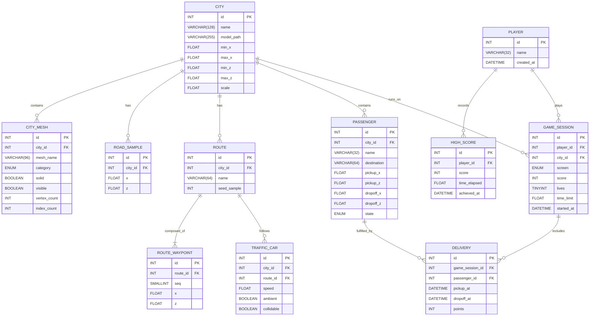

# MariaDB Design Diagram

Relational mapping of the game's runtime design. The game has no database: scores
are kept in `scoreboard.txt` (top-5 CSV). This document maps the actual runtime
entities (`City`, `CityMap`, `Route`, `TrafficCar`, `Passenger`, `Game`, `Player`)
onto a normalised MariaDB schema, and ships a ready-to-run DDL.

## Entity Relationship Diagram



## Design Notes

- Coordinates are stored as `x`/`z` only — the game simulates movement in the XZ plane
  (`engine-window` picks waypoints from `ROAD_SAMPLE`, traffic follows `ROUTE_WAYPOINT`,
  passengers drive between `CityMap` waypoints); `y` is derived from mesh/sampling.
- `CITY_MESH.category` + `solid`/`visible` flags replace the fragile mesh-name string
  heuristics (`contains("street")`, `contains("building")`, `contains("collision")`).
- `GAME_SESSION`, `DELIVERY` and `PASSENGER` make the 100-point drop-off rule queryable.
- `HIGH_SCORE` replaces `scoreboard.txt`; `GAME_SESSION` captures one play-through.

## DDL (MariaDB 10.x)

```sql
CREATE TABLE player (
  id INT UNSIGNED NOT NULL AUTO_INCREMENT,
  name VARCHAR(32) NOT NULL,
  created_at DATETIME NOT NULL DEFAULT CURRENT_TIMESTAMP,
  PRIMARY KEY (id)
) ENGINE=InnoDB DEFAULT CHARSET=utf8mb4;

CREATE TABLE high_score (
  id  INT UNSIGNED NOT NULL AUTO_INCREMENT,
  player_id INT UNSIGNED NOT NULL,
  score INT NOT NULL,
  time_elapsed FLOAT NOT NULL,
  achieved_at DATETIME NOT NULL DEFAULT CURRENT_TIMESTAMP,
  PRIMARY KEY (id),
  CONSTRAINT fk_high_score_player FOREIGN KEY (player_id) REFERENCES player (id)
) ENGINE=InnoDB DEFAULT CHARSET=utf8mb4;

CREATE TABLE city (
  id  INT UNSIGNED NOT NULL AUTO_INCREMENT,
  name VARCHAR(128) NOT NULL,
  model_path VARCHAR(255) NOT NULL,
  min_x FLOAT NOT NULL,
  max_x FLOAT NOT NULL,
  min_z FLOAT NOT NULL,
  max_z FLOAT NOT NULL,
  scale FLOAT NOT NULL DEFAULT 1.0,
  PRIMARY KEY (id)
) ENGINE=InnoDB DEFAULT CHARSET=utf8mb4;

CREATE TABLE city_mesh (
  id INT UNSIGNED NOT NULL AUTO_INCREMENT,
  city_id INT UNSIGNED NOT NULL,
  mesh_name VARCHAR(96) NOT NULL,
  category ENUM('building','street','collision','other') NOT NULL DEFAULT 'other',
  solid BOOLEAN NOT NULL DEFAULT FALSE,
  visible BOOLEAN NOT NULL DEFAULT TRUE,
  vertex_count INT UNSIGNED NOT NULL DEFAULT 0,
  index_count INT UNSIGNED NOT NULL DEFAULT 0,
  PRIMARY KEY (id),
  CONSTRAINT fk_mesh_city FOREIGN KEY (city_id) REFERENCES city (id)
) ENGINE=InnoDB DEFAULT CHARSET=utf8mb4;

CREATE TABLE road_sample (
  id INT UNSIGNED NOT NULL AUTO_INCREMENT,
  city_id INT UNSIGNED NOT NULL,
  x FLOAT NOT NULL,
  z FLOAT NOT NULL,
  PRIMARY KEY (id),
  KEY idx_sample_city (city_id),
  KEY idx_sample_pos (city_id, x, z),
  CONSTRAINT fk_sample_city FOREIGN KEY (city_id) REFERENCES city (id)
) ENGINE=InnoDB DEFAULT CHARSET=utf8mb4;

CREATE TABLE route (
  id INT UNSIGNED NOT NULL AUTO_INCREMENT,
  city_id INT UNSIGNED NOT NULL,
  name VARCHAR(64) NOT NULL,
  seed_sample INT UNSIGNED NOT NULL,
  PRIMARY KEY (id),
  CONSTRAINT fk_route_city FOREIGN KEY (city_id) REFERENCES city (id)
) ENGINE=InnoDB DEFAULT CHARSET=utf8mb4;

CREATE TABLE route_waypoint (
  id INT UNSIGNED NOT NULL AUTO_INCREMENT,
  route_id INT UNSIGNED NOT NULL,
  seq SMALLINT UNSIGNED NOT NULL,
  x FLOAT NOT NULL,
  z FLOAT NOT NULL,
  PRIMARY KEY (id),
  UNIQUE KEY uq_waypoint (route_id, seq),
  CONSTRAINT fk_waypoint_route FOREIGN KEY (route_id) REFERENCES route (id)
) ENGINE=InnoDB DEFAULT CHARSET=utf8mb4;

CREATE TABLE traffic_car (
  id INT UNSIGNED NOT NULL AUTO_INCREMENT,
  city_id INT UNSIGNED NOT NULL,
  route_id INT UNSIGNED NOT NULL,
  speed FLOAT NOT NULL DEFAULT 1.0,
  ambient BOOLEAN NOT NULL DEFAULT TRUE,
  collidable BOOLEAN NOT NULL DEFAULT TRUE,
  PRIMARY KEY (id),
  CONSTRAINT fk_car_city FOREIGN KEY (city_id) REFERENCES city (id),
  CONSTRAINT fk_car_route FOREIGN KEY (route_id) REFERENCES route (id)
) ENGINE=InnoDB DEFAULT CHARSET=utf8mb4;

CREATE TABLE passenger (
  id INT UNSIGNED NOT NULL AUTO_INCREMENT,
  city_id INT UNSIGNED NOT NULL,
  name VARCHAR(32) NOT NULL,
  destination VARCHAR(64) NOT NULL,
  pickup_x FLOAT NOT NULL,
  pickup_z FLOAT NOT NULL,
  dropoff_x FLOAT NOT NULL,
  dropoff_z FLOAT NOT NULL,
  state ENUM('waiting','picked_up','delivered') NOT NULL DEFAULT 'waiting',
  PRIMARY KEY (id),
  CONSTRAINT fk_passenger_city FOREIGN KEY (city_id) REFERENCES city (id)
) ENGINE=InnoDB DEFAULT CHARSET=utf8mb4;

CREATE TABLE game_session (
  id INT UNSIGNED NOT NULL AUTO_INCREMENT,
  player_id INT UNSIGNED NOT NULL,
  city_id INT UNSIGNED NOT NULL,
  screen ENUM('menu','driving','trip_complete','game_over') NOT NULL,
  score INT NOT NULL DEFAULT 0,
  lives TINYINT UNSIGNED NOT NULL,
  time_limit FLOAT NOT NULL,
  started_at DATETIME NOT NULL DEFAULT CURRENT_TIMESTAMP,
  PRIMARY KEY (id),
  CONSTRAINT fk_session_player FOREIGN KEY (player_id) REFERENCES player (id),
  CONSTRAINT fk_session_city FOREIGN KEY (city_id) REFERENCES city (id)
) ENGINE=InnoDB DEFAULT CHARSET=utf8mb4;

CREATE TABLE delivery (
  id INT UNSIGNED NOT NULL AUTO_INCREMENT,
  game_session_id INT UNSIGNED NOT NULL,
  passenger_id INT UNSIGNED NOT NULL,
  pickup_at DATETIME NULL,
  dropoff_at DATETIME NULL,
  points INT NOT NULL DEFAULT 0,
  PRIMARY KEY (id),
  CONSTRAINT fk_delivery_session FOREIGN KEY (game_session_id) REFERENCES game_session (id),
  CONSTRAINT fk_delivery_passenger FOREIGN KEY (passenger_id) REFERENCES passenger (id)
) ENGINE=InnoDB DEFAULT CHARSET=utf8mb4;
```