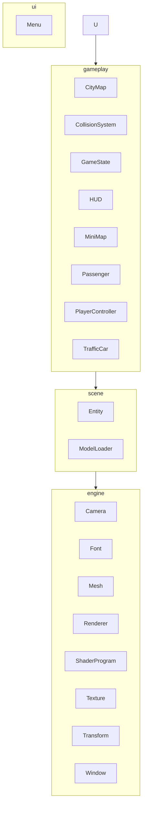
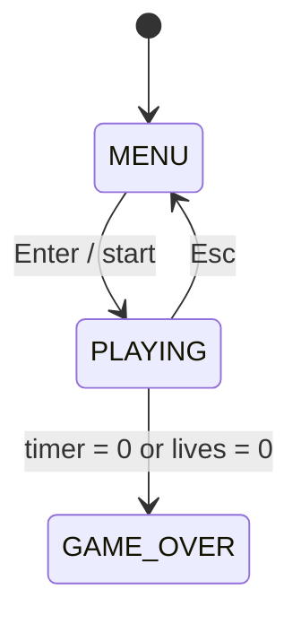

# City Racer

[](https://openjdk.org/projects/jdk/)
[](https://www.lwjgl.org/)
[](https://www.opengl.org/)
[](https://maven.apache.org/)
[]()

[](https://github.com/PSLSbb/gamegame)
[](https://github.com/PSLSbb/gamegame)
[](https://github.com/PSLSbb/gamegame/search?l=Java)
[](https://github.com/PSLSbb/gamegame/issues)

City Racer is a Java/LWJGL passenger-delivery driving game. Drive a van through a 3D city, pick up passengers at green markers, drop them off at yellow markers, avoid traffic, and score as many deliveries as possible before time or lives run out.

## Quick Start

```bash
mvn package && java -jar target/city-racer-new-variation-ref-1.0.jar
```

Requires JDK 21+, Maven 3.8+, OpenGL 3.3 Core, and a desktop display session. `pom.xml` currently targets `natives-linux` — change `lwjgl.natives` (e.g. `natives-windows`) for other OSes.

## How to Play

- **Objective:** deliver passengers before the 5-minute timer or 3 lives run out. Each delivery is worth 100 points.
- **Controls:** `W`/`Up` accelerate · `S`/`Down` brake · `A`/`Left`, `D`/`Right` turn · `Enter` select · `Esc` menu.
- **Markers:** green = pickup, yellow = drop-off.
- **Traffic:** a hit costs one life and respawns you at the start.
- **HUD:** score, timer, speed, lives, deliveries, passenger hint, and a minimap. Top-5 scores persist via the `scoring` package.

## Architecture

`game.Main` (the coordinator) layers cleanly: `ui` → `gameplay` → `scene` → `engine`, with shared contracts in `core` and persistence in `scoring`.





## Assets

| Asset | Path | Role |
| --- | --- | --- |
| City map | `source/burnin_rubber_crash_n_burn_city.glb` | World geometry (~18 MB) |
| Player vehicle | `1982_toyota_hiace_combi.glb` | Player car (~34 MB) |
| Traffic vehicle | `bmw_m4_competition_m_package.glb` | Traffic clones (~23 MB) |
| Passenger | `assets/passengers/passenger.glb` | Pickup/drop-off character, Cesium CC-BY 4.0 |

Embedded textures land in `textures/` (`gltf_embedded_0.png` … `gltf_embedded_8.png`).

## Key Systems

- **Main loop** (`Main.loop()`): computes `deltaTime` capped at `0.05f`, updates the screen, renders, swaps buffers.
- **Player** (`PlayerController`): arcade driving — accel `12.0f`, max speed `30.0f`, turn `2.5f`, friction `4.0f`.
- **Traffic** (`Main.createTraffic()`): up to 8 cars, speed `4.0f + rand()*4.0f`, looping generated routes.
- **Collisions** (`CollisionSystem`): city bounds, solid `building` meshes, and traffic hits (costs a life, 2-second cooldown).
- **Rendering** (`Renderer`): depth-tested 3D with a simple directional light; orthographic 2D UI at 1280x720; font-fallback blocks.

## Project Structure

```text
src/main/java/game
|-- Main.java
|-- core/      GameObject, Renderable, Updatable
|-- engine/    Camera, Font, Mesh, Renderer, ShaderProgram, Texture, Transform, Window
|-- gameplay/  CityMap, CollisionSystem, GameState, HUD, MiniMap, Passenger, PlayerController, TrafficCar
|-- scene/     Entity, ModelLoader
|-- scoring/   ScoreEntry, Scoreboard, ScoreboardManager
`-- resources/shaders/  vertex+fragment, menu_vertex+menu_fragment
```

## Build Commands

```bash
mvn compile                      # build
mvn package                      # shaded jar
mvn exec:java -Dexec.mainClass=game.Main   # run from classes
```

No test suite is currently defined (`mvn test` exits with no tests).

## Notes

- Window is fixed at 1280x720; HUD/minimap coordinates are hard-coded.
- Scores persist to `scoreboard.txt` through `Scoreboard` / `ScoreboardManager`.
- Model paths live at the top of `Main.java`; `ModelLoader.resolveModelPath()` searches working dir, path, parent projects, and packaged resources.
- Tuning knobs: `GameState` (timer/lives/score), `PlayerController` (physics), `Passenger` (radii), `Main` (traffic, cooldown), `Camera` (follow sampling).

See `MARIA_DESIGN_DIAGRAM.md` for a proposed relational (MariaDB) schema mapping this design.