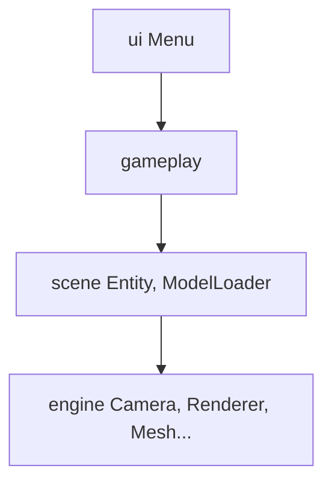
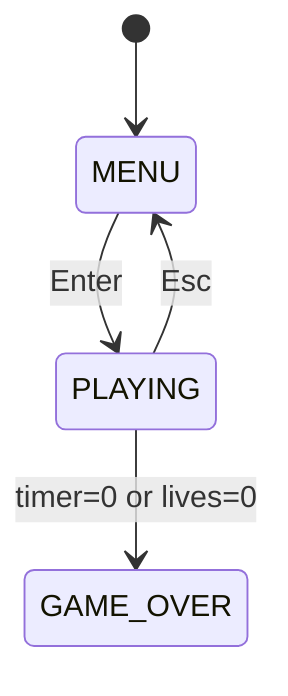
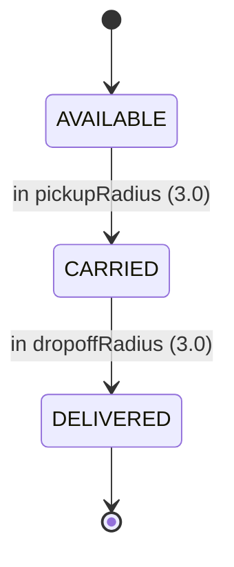

# 🚐 City Racer

[](https://openjdk.org/projects/jdk/)
[](https://www.lwjgl.org/)
[](https://www.opengl.org/)
[](https://github.com/JOML-CI/JOML)
[](https://assimp.org/)
[](https://www.khronos.org/opengl/wiki/GLSL)

[](https://maven.apache.org/)
[]()
[]()
[]()

[](https://github.com/PSLSbb/gamegame)
[](https://github.com/PSLSbb/gamegame)
[](https://github.com/PSLSbb/gamegame)
[](https://github.com/PSLSbb/gamegame/graphs/contributors)

[](https://github.com/PSLSbb/gamegame/releases)
[](https://github.com/PSLSbb/gamegame)
[](https://github.com/PSLSbb/gamegame/issues)
[](https://github.com/PSLSbb/gamegame/pulls)
[](https://github.com/PSLSbb/gamegame)
[](https://github.com/PSLSbb/gamegame)
[](https://github.com/PSLSbb/gamegame)
[](https://github.com/PSLSbb/gamegame)

A **Java/LWJGL passenger-delivery driving game**. Drive a van through a loaded 3D city, pick up passengers at green markers, drop them off at yellow markers, dodge traffic, and score as many deliveries as possible before time or lives run out.

Compact custom stack: OpenGL renderer, Assimp GLB loading, arcade vehicle physics, generated traffic routes, passenger objectives, HUD + minimap.

---

## ✨ Features

- **Gameplay** — passenger pickup/delivery, 5-min timer (100 pts per delivery), 3 lives, crash respawn w/ cooldown
- **World** — real 3D city map (GLB), generated traffic routes (≤8 cars), fallback procedural city/car if models fail
- **Rendering** — custom OpenGL 3.3 engine, directional lighting, shaders, third-person chase camera, HUD + minimap
- **UI** — menu, instructions, scoreboard (top-5, `scoreboard.txt`), game-over screen
- **Controls** — `WASD`/arrows to drive, `↑↓`+`Enter` for menu, `Esc` back

## 🚀 Quick Start

```bash
mvn package && java -jar target/city-racer-new-variation-ref-1.0.jar
```

Requires **JDK 21+**, Maven 3.8+ and a **Linux** desktop with OpenGL 3.3 Core (glfw-native classifier is `natives-linux` in `pom.xml`). For Windows/macOS change `lwjgl.natives`.

Commands: `mvn compile` · `mvn package` · `mvn exec:java -Dexec.mainClass=game.Main`

## 🕹️ How to Play

| Action | Keys |
| --- | --- |
| Accelerate / Brake | `W`/`↑` · `S`/`↓` |
| Turn left / right | `A`/`←` · `D`/`→` |
| Menu navigate / select | `↑` `↓` / `Enter` |
| Back to menu | `Esc` |

Find the passenger at the **green** marker → drive to the **yellow** drop-off. Hitting traffic costs a life (2s cooldown). Game ends when timer or lives hit zero.

## 🗂 Project Structure

```text
├── source/burnin_rubber_crash_n_burn_city.glb   # city map (~18 MB)
├── 1982_toyota_hiace_combi.glb                 # player van (~34 MB)
├── bmw_m4_competition_m_package.glb            # traffic car (~23 MB)
├── assets/passengers/passenger.glb             # CesiumMan (CC-BY 4.0)
├── textures/gltf_embedded_0..8.png             # extracted textures
└── src/main/java/game
    ├── Main.java          # app coordinator / main loop
    ├── core              # GameObject, Renderable, Updatable
    ├── engine            # Camera, Mesh, Renderer, Texture, ShaderProgram, Font, Window
    ├── scene             # Entity, ModelLoader
    ├── gameplay          # CityMap, GameState, CollisionSystem, Passenger, TrafficCar, HUD, MiniMap
    ├── ui                # Menu
    └── scoring           # Scoreboard, ScoreboardManager, ScoreEntry
```

## 🏗 Architecture

Layered so higher layers depend only on lower ones; `Main` coordinates everything.



### Game state machine



### Passenger state machine



## ⚙️ Tuning Guide

| Goal | File | Values |
| --- | --- | --- |
| Time / lives / score | `gameplay/GameState.java` | `timeLimit`, `lives`, `deliverPassenger()` |
| Car physics | `gameplay/PlayerController.java` | `acceleration`, `maxSpeed`, `turnSpeed`, `friction` |
| Pickup radius | `gameplay/Passenger.java` | `pickupRadius`, `dropoffRadius` |
| Traffic | `Main.java` | `trafficCount`, speed in `createTraffic()`|
| Collision | `gameplay/CollisionSystem.java` | `carCollisionRadius`, solid = meshes named `building` |
| Crash cooldown | `Main.java` | `CRASH_COOLDOWN_SECONDS` |
| Camera | `engine/Camera.java` | `distance`, `height`, `lookHeight` |

Extend: swap `.glb` models (update paths in `Main.java`), add passengers in `CityMap.generateRoadSamplePassengerLocations()`, add routes in `CityMap.generateRoutes()`.

## 🧩 Troubleshooting

- **Compile error** — need JDK 21+ or lower `maven.compiler.source/target`
- **LWJGL native errors** — wrong OS classifier; set `lwjgl.natives` for your platform
- **Window won't open** — needs a desktop session w/ OpenGL 3.3 Core (no headless/SSH)
- **Models don't load** — check model paths; game falls back to placeholder geometry
- **Text shows as blocks** — install a system font from `Renderer`'s search list

## 📄 Related Docs

- `MARIA_DESIGN_DIAGRAM.md` — proposed relational (MariaDB) schema for the game's design