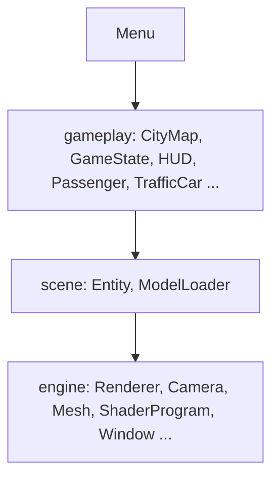
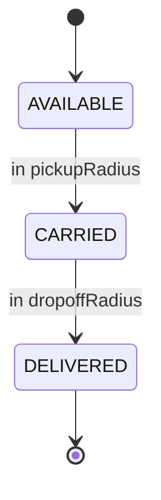

# City Racer

[](https://openjdk.org/projects/jdk/)
[](https://www.lwjgl.org/)
[](https://www.opengl.org/)
[](https://github.com/JOML-CI/JOML)
[]()
[](https://maven.apache.org/)
[]()

[](https://github.com/PSLSbb/gamegame)
[](https://github.com/PSLSbb/gamegame)
[](https://github.com/PSLSbb/gamegame/search?l=Java)
[](https://github.com/PSLSbb/gamegame/issues)

A Java/LWJGL passenger-delivery driving game. Drive a van through a loaded 3D city, pick up passengers at green markers, drop them off at yellow markers, dodge traffic, and max out deliveries before time or lives run out. Small custom engine: GLB models via Assimp, arcade driving, generated traffic routes, HUD and minimap.

## Features

- 3D city driving (LWJGL 3, GLFW, OpenGL 3.3, JOML, Assimp).
- GLB city / vehicle / passenger models with placeholder fallbacks.
- Passenger pickup & drop-off gameplay, five-minute timer, three lives.
- Traffic following generated routes, third-person camera.
- HUD (score, timer, speed, lives, hints), minimap, menu, instructions, scoreboard, game-over.
- Top-5 score persistence via `scoreboard.txt` (`game.scoring` package).

## Requirements

- JDK 21+ and Maven 3.8+.
- Linux LWJGL natives (`natives-linux` in `pom.xml`). For Windows/macOS update the `lwjgl.natives` property.
- OpenGL 3.3 Core and a desktop display session (no headless/SSH).

## Quick Start

```bash
mvn clean package            # build shaded jar
java -jar target/city-racer-new-variation-ref-1.0.jar
```

For a local Maven-driven run: `mvn exec:java -Dexec.mainClass=game.Main`. No tests are defined yet.

## How to Play

- Pick up passengers at green markers, deliver at yellow markers (each delivery = 100 pts).
- Timer: 5 min, lives: 3. Hitting traffic costs a life and respawns you.
- Game ends when the timer or lives run out.

| Action | Keys |
| --- | --- |
| Accelerate / brake | `W`/`S` or `↑`/`↓` |
| Turn | `A`/`D` or `←`/`→` |
| Menu | `↑`/`↓` + `Enter` |
| Back / close | `Esc` |

## Project Structure

```text
|-- pom.xml
|-- source/burnin_rubber_crash_n_burn_city.glb   # city map
|-- 1982_toyota_hiace_combi.glb                  # player van
|-- bmw_m4_competition_m_package.glb             # traffic car
|-- assets/passengers/passenger.glb              # CesiumMan (CC-BY 4.0)
|-- textures/gltf_embedded_*.png                 # extracted embedded textures
`-- src/main/java/game
    |-- Main.java            # coordinator / god class
    |-- core/                # GameObject, Renderable, Updatable
    |-- engine/              # Camera, Renderer, ShaderProgram, Window, ...
    |-- scene/               # Entity, ModelLoader
    |-- gameplay/            # CityMap, CollisionSystem, GameState, HUD, ...
    `-- scoring/             # ScoreEntry, Scoreboard, ScoreboardManager
```

Layers: `ui → gameplay → scene → engine`.

## Architecture

`game.Main` owns the window, renderer, camera, gameplay systems, models, and main loop.



Game screens (`GameState.GameScreen`): `MENU → PLAYING → GAME_OVER` (Esc returns to menu). Passenger lifecycle matching `Passenger.java` radii (`pickupRadius`/`dropoffRadius` = 3.0):



## Tuning

| Goal | File | Edit |
| --- | --- | --- |
| Time / lives / score | `game/gameplay/GameState.java` | `timeLimit`, `lives`, `deliverPassenger()` |
| Car physics | `game/gameplay/PlayerController.java` | `acceleration`, `maxSpeed`, `turnSpeed`, `friction` |
| Pickup/drop-off radius | `game/gameplay/Passenger.java` | `pickupRadius`, `dropoffRadius` |
| Traffic | `game/Main.java` | `trafficCount`, speed, `CRASH_COOLDOWN_SECONDS` |
| Collision size | `game/gameplay/CollisionSystem.java` | `carCollisionRadius`, `buildingCollisionRadius` |
| Camera | `game/engine/Camera.java` | `distance`, `height`, `lookHeight` |

- Replace a vehicle/city: drop a new `.glb` and update `*_MODEL_PATH` in `Main.java`; name road meshes with road words (`street`, `crosses`, `bridge`, `tunnel`) and buildings `building`.
- Rendering: world shaders in `src/main/resources/shaders/` (`vertex/fragment.glsl`, `menu_*`). Single directional light, opaque-then-transparent draw order, 2D orthographic UI.

## Troubleshooting

- Compile/class-version errors → JDK 21+ or lower `maven.compiler.source/target`.
- LWJGL native errors / no window → wrong `lwjgl.natives` for your OS, or no display/OpenGL 3.3 session.
- Models not loading → GLBs bundled as Maven resources; watch startup logs for Assimp errors (fallback geometry kicks in).
- Text as blocks → system font missing; install a common font or extend `Renderer`'s font path list.

## Related Documents

- `MARIA_DESIGN_DIAGRAM.md` — proposed MariaDB schema mapping the game's runtime design.