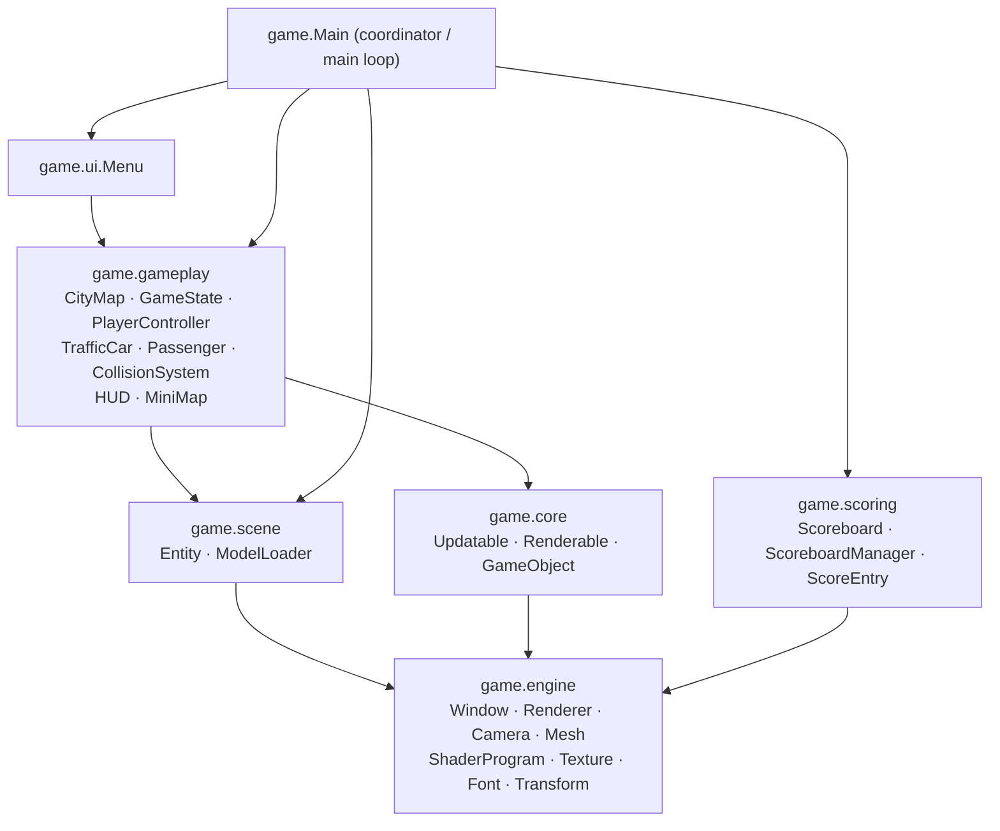
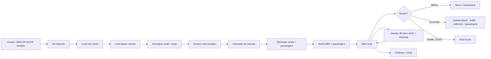
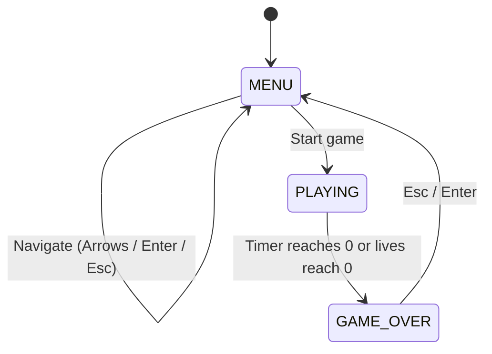
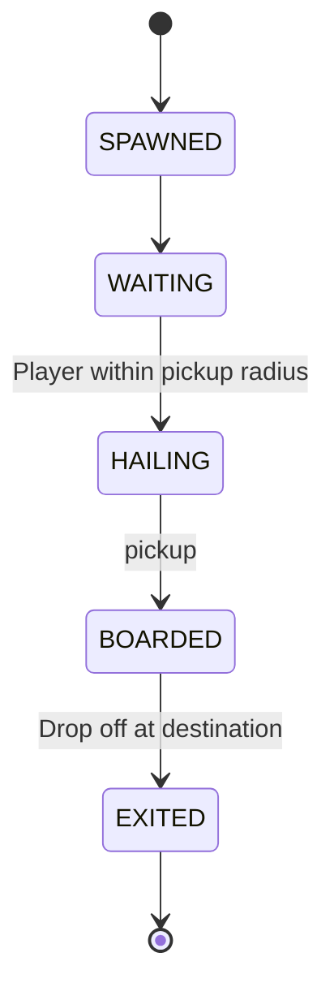

# City Racer


City Racer is a Java/LWJGL passenger-delivery driving game. The player drives a van through a loaded 3D city map, picks up passengers at green markers, drops them off at yellow markers, avoids traffic cars, and tries to score as many deliveries as possible before time or lives run out.

The project is intentionally compact: it has a small custom rendering/gameplay stack, GLB model loading through Assimp, arcade-style vehicle movement, generated traffic routes, passenger objectives, a HUD, and a minimap.

## Contents

- [Features](#features)
- [Badges](#badges)
- [Requirements](#requirements)
- [Project Structure](#project-structure)
- [Quick Start](#quick-start)
- [How to Play](#how-to-play)
- [Build and Run Commands](#build-and-run-commands)
- [Architecture Overview](#architecture-overview)
- [Core Systems](#core-systems)
- [Asset and Model Pipeline](#asset-and-model-pipeline)
- [Rendering and Shaders](#rendering-and-shaders)
- [Gameplay Tuning Guide](#gameplay-tuning-guide)
- [Adding or Changing Content](#adding-or-changing-content)
- [Troubleshooting](#troubleshooting)
- [Development Notes](#development-notes)
- [Related Documents](#related-documents)

## Features

- 3D city driving using LWJGL 3, GLFW, OpenGL 3.3, JOML, STB, and Assimp.
- GLB model loading for both the city map and player vehicle.
- Passenger pickup and drop-off gameplay.
- Five-minute game timer.
- Three-life collision system.
- Traffic cars following generated routes.
- Third-person chase camera.
- HUD with score, timer, speed, lives, delivery count, and passenger hints.
- Minimap with road samples, traffic routes, player direction, passengers, traffic, and spawn location.
- Menu, instructions screen, and game-over screen.
- Fallback city/car generation if model loading fails.

## Badges

| Badge | Meaning |
| --- | --- |
| **Java 26** | Requires JDK 26+ (set in `pom.xml`) |
| **LWJGL 3.3.6** | GLFW, OpenGL, Assimp, STB bindings |
| **OpenGL 3.3** | Core profile shader pipeline |
| **Maven 3.8+** | Build tool |
| **JOML 1.10.8** | Math library |
| **Linux / Win / macOS** | Natives are selectable via `lwjgl.natives` in `pom.xml` (default: Linux) |

The GitHub badges (`repo-size`, `last-commit`, `languages/top`, `open-issues`) render live from the `PSLSbb/gamegame` repository.

## Requirements

The Maven project is configured for:

- JDK 26 or newer, based on `maven.compiler.source` and `maven.compiler.target` in `pom.xml`.
- Maven 3.8+.
- Linux native LWJGL libraries, because `pom.xml` sets:

```xml
<lwjgl.natives>natives-linux</lwjgl.natives>
```

- A graphics environment that supports OpenGL 3.3 Core Profile.
- A desktop display session for GLFW. Headless terminals usually cannot run the game window without extra display setup.

For Windows or macOS, update the `lwjgl.natives` property in `pom.xml` to the matching LWJGL classifier, such as `natives-windows`, `natives-macos`, or the platform-specific variant required by your machine.

## Project Structure

```text
.
|-- pom.xml
|-- dependency-reduced-pom.xml
|-- assets/passengers
|   `-- passenger.glb
|-- source
|   `-- burnin_rubber_crash_n_burn_city.glb
|-- textures
|   `-- gltf_embedded_*.png
|-- 1982_toyota_hiace_combi.glb
|-- bmw_m4_competition_m_package.glb
|-- src/main/java/game
|   |-- Main.java
|   |-- core
|   |   |-- GameObject.java
|   |   |-- Renderable.java
|   |   `-- Updatable.java
|   |-- engine
|   |   |-- Camera.java
|   |   |-- Font.java
|   |   |-- Mesh.java
|   |   |-- Renderer.java
|   |   |-- ShaderProgram.java
|   |   |-- Texture.java
|   |   |-- Transform.java
|   |   `-- Window.java
|   |-- gameplay
|   |   |-- CityMap.java
|   |   |-- CollisionSystem.java
|   |   |-- GameState.java
|   |   |-- HUD.java
|   |   |-- MiniMap.java
|   |   |-- Passenger.java
|   |   |-- PlayerController.java
|   |   |-- ScoreboardManager.java
|   |   |-- ScoreEntry.java
|   |   `-- TrafficCar.java
|   |-- scene
|   |   |-- Entity.java
|   |   `-- ModelLoader.java
|   |-- scoring
|   |   |-- Scoreboard.java
|   |   |-- ScoreboardManager.java
|   |   `-- ScoreEntry.java
|   `-- ui
|       `-- Menu.java
`-- src/main/resources/shaders
    |-- fragment.glsl
    |-- menu_fragment.glsl
    |-- menu_vertex.glsl
    `-- vertex.glsl
```

Generated files live in `target/`. Do not edit `.class` files under `target/classes`; edit the Java source under `src/main/java`.

## Quick Start

From the repository root:

```bash
mvn package
java -jar target/city-racer-new-variation-ref-1.0.jar
```

During the first Maven build, dependencies may need to be downloaded from Maven Central.

The shaded jar is configured with `game.Main` as the entry point, so the `java -jar` command should open the game window directly.

## How to Play

Objective:

- Drive through the city.
- Find passengers at green pickup markers.
- Drive to the active passenger's yellow drop-off marker.
- Avoid traffic cars.
- Keep the car within the city bounds.
- Deliver as many passengers as possible before the timer expires or lives reach zero.

Controls:

| Action | Keys |
| --- | --- |
| Accelerate | `W` or `Up Arrow` |
| Brake / reverse | `S` or `Down Arrow` |
| Turn left | `A` or `Left Arrow` |
| Turn right | `D` or `Right Arrow` |
| Navigate menu | `Up Arrow`, `Down Arrow` |
| Select menu item | `Enter` |
| Return to menu / close instructions | `Esc` |

Rules:

- Each delivered passenger is worth 100 points.
- The timer starts at five minutes.
- The player starts with three lives.
- Hitting traffic costs one life and returns the player to the spawn point.
- The game ends when the timer reaches zero or lives reach zero.

HUD:

- Top left: score.
- Top center: remaining time.
- Top right: speed in km/h.
- Bottom left: lives.
- Left side: delivery count.
- Center notification: nearest passenger or current drop-off objective.
- Minimap: road samples, traffic routes, player direction, passengers, traffic, and spawn point.

## Build and Run Commands

Compile:

```bash
mvn compile
```

Package a runnable shaded jar:

```bash
mvn package
```

Run the packaged game:

```bash
java -jar target/city-racer-new-variation-ref-1.0.jar
```

Run from compiled classes with Maven-managed dependencies:

```bash
mvn exec:java -Dexec.mainClass=game.Main
```

The project does not currently define tests. If tests are added later, run them with:

```bash
mvn test
```

## Architecture Overview

`game.Main` is the application coordinator. It creates the window, renderer, camera, game state, gameplay systems, models, entities, input callbacks, and main loop.

### Package Layering

The code is organised into four vertical layers; dependencies only flow downward:



### Runtime Flow

At runtime, the game follows this flow:



### Game State Machine



### Passenger State Machine



### Packages

`game.engine` contains low-level rendering and platform utilities:

- `Window`: GLFW window creation, input callbacks, buffer swapping, event polling, and shutdown.
- `Renderer`: 3D entity rendering, 2D rectangles/lines/diamonds/text, shader setup, lighting uniforms, and frame state.
- `ShaderProgram`: shader compilation, program linking, and uniform setters.
- `Mesh`: OpenGL VAO/VBO/EBO storage plus bounds, material color, alpha, texture ID, and vertex lookup helpers.
- `Texture`: STB image loading for file, embedded, and raw texture data.
- `Font`: bitmap font atlas creation for HUD/menu text.
- `Camera`: third-person camera view and perspective projection.
- `Transform`: position, rotation, scale, origin offset, and model matrix construction.

`game.core` contains the OOP teaching contracts:

- `Updatable`: `update(float dt)` interface implemented by gameplay systems.
- `Renderable`: `render(Renderer, Camera, Vector3f)` interface for world objects.
- `GameObject`: abstract parent with shared id, display name, and active state.

`game.scene` contains scene-level abstractions:

- `Entity`: a renderable object with a mesh, transform, color, visibility flag, velocity, speed, and type. Extends `GameObject`.
- `ModelLoader`: GLB/GLTF loading through Assimp, node traversal, mesh conversion, material color/alpha extraction, and texture loading.

`game.gameplay` contains game rules and simulation:

- `GameState`: current screen, score, lives, timer, menu selection, passenger state, and game reset logic.
- `PlayerController`: car input state, acceleration, braking, friction, turning, movement, rotation, and camera follow updates.
- `TrafficCar`: waypoint-following traffic movement and orientation.
- `CityMap`: generated traffic routes and passenger pickup/drop-off points.
- `Passenger`: pickup/drop-off state and range checks.
- `CollisionSystem`: city bounds enforcement, player-vs-traffic checks, and building mesh collision resolution.
- `HUD`: score, timer, speed, lives, delivery count, and passenger hint rendering.
- `MiniMap`: map overlay rendering for roads, routes, player, traffic, passengers, and spawn.
- `ScoreboardManager` / `ScoreEntry` (deprecated aliases of `game.scoring.*`).

`game.scoring` contains score persistence:

- `Scoreboard`: top-5 high score storage.
- `ScoreboardManager`: CSV read/write to `scoreboard.txt`.
- `ScoreEntry`: a single score record.

`game.ui` contains screen UI:

- `Menu`: main menu, instructions, pulsing selection highlight, and game-over screen.

## Core Systems

### Main Loop

The main loop in `Main.loop()` calculates `deltaTime`, polls window events, starts a new render frame, updates the active screen, and swaps buffers.

`deltaTime` is capped to `0.05f` seconds to keep physics and movement from jumping too far after a long frame.

```java
float deltaTime = (now - lastTime) / 1_000_000_000.0f;
if (deltaTime > 0.05f) deltaTime = 0.05f;
```

### Screen State

`GameState.GameScreen` has three states:

- `MENU`
- `PLAYING`
- `GAME_OVER`

The menu handles start, instructions, and quit. Gameplay updates the timer, player, traffic, collisions, passengers, and scene rendering. Game-over draws the final score and delivered passenger count.

### Player Movement

`PlayerController` implements arcade driving:

- Forward acceleration: `12.0f`
- Max forward speed: `30.0f`
- Reverse speed limit: `40%` of max speed
- Braking/reverse acceleration: `8.0f`
- Turn speed: `2.5f`
- Friction: `4.0f`

The car moves along its forward vector, which is derived from the current Y rotation. The camera follows behind and above the car with smoothing.

### Passenger Flow

Passenger locations are generated by `CityMap`. In each gameplay update:

1. If the player is within pickup radius of an available passenger, the passenger is picked up.
2. If the player is carrying that passenger and enters the drop-off radius, the passenger is delivered.
3. `GameState.deliverPassenger()` increments delivered counts and adds 100 points.

Pickup and drop-off radii are currently `3.0f` world units in `Passenger`.

### Traffic

Traffic cars are created from the player car mesh and assigned generated routes. Each traffic car moves toward its current waypoint, advances when close, wraps around the route, and rotates to face movement direction.

Traffic speed is randomized in `Main.createTraffic()`:

```java
float speed = 4.0f + (float) Math.random() * 4.0f;
```

The number of traffic cars is capped at eight:

```java
int trafficCount = Math.min(8, carMeshes.size() * 8);
```

### Collisions

There are three collision-related behaviors:

- City bounds: the player position is clamped to the calculated city bounds.
- Building collision: building meshes push the player away from solid wall-like triangle edges.
- Traffic collision: if the player is within two car radii of a traffic car, the player loses a life and respawns.

The player has a crash cooldown of two seconds after respawning, preventing immediate repeat collisions.

## Asset and Model Pipeline

### Bundled Assets

| Asset | Role | Location | Size |
| --- | --- | --- | --- |
| `burnin_rubber_crash_n_burn_city.glb` | City / map model | `source/` | ~18 MB |
| `1982_toyota_hiace_combi.glb` | Player van | repo root | ~33 MB |
| `bmw_m4_competition_m_package.glb` | Traffic car model | repo root | ~22 MB |
| `passenger.glb` | Passenger character (CesiumMan) | `assets/passengers/` | ~480 KB |
| `gltf_embedded_*.png` | Texture atlas slices | `textures/` | ~4.3 MB total |

`pom.xml` includes root-level `*.glb`, `source/*.glb`, `assets/passengers/*.glb`, and `textures/*` as packaged resources:

```xml
<resource>
    <directory>${project.basedir}</directory>
    <includes>
        <include>*.glb</include>
        <include>*.gltf</include>
        <include>source/*.glb</include>
        <include>source/*.gltf</include>
        <include>textures/*.png</include>
        <include>textures/*.jpg</include>
        <include>textures/*.jpeg</include>
        <include>textures/*.webp</include>
    </includes>
</resource>
```

### Asset Attribution

- `assets/passengers/passenger.glb` — **CesiumMan** from the [KhronosGroup glTF Sample Models](https://github.com/KhronosGroup/glTF-Sample-Models/tree/main/2.0/CesiumMan), licensed under CC-BY 4.0. See `assets/passengers/ATTRIBUTION.txt`.
- City, van, and traffic models are third-party assets bundled for the demo; verify their licenses before redistributing.

### Asset Resolution

`ModelLoader.resolveModelPath()` searches in this order:

1. The provided path directly.
2. The current working directory.
3. Nearby parent project directories.
4. Packaged resources on the classpath.

When a model is loaded from packaged resources, it is copied to a temporary file so Assimp can import it by path.

### City Model Processing

The city model is normalized in `Main.createCityScene()`:

- Bounds are calculated from renderable meshes.
- The center is shifted toward the origin.
- Ground height is estimated from street/parking/crossing meshes.
- Scale is derived from city width so the map fits gameplay space.
- Collision and invisible meshes are skipped for rendering.

Road samples are collected from meshes whose names look road-like:

- `street`
- `collisiontraffic`
- `crosses`
- `parking`
- `bridge`
- `tunnel`

Lightmap and invisible meshes are ignored for road sampling.

### Car Model Processing

The vehicle model is normalized in `Main.createPlayerCar()`:

- The mesh center is moved to the local origin.
- The bottom of the model is placed at ground level.
- The length is scaled to about `4.5f` world units.
- Very tall or flat models are adjusted to stay usable.
- The model uses a `PI` yaw offset so it faces the gameplay forward direction.

## Rendering and Shaders

The renderer uses two shader programs:

- 3D world shader:
  - `src/main/resources/shaders/vertex.glsl`
  - `src/main/resources/shaders/fragment.glsl`

- 2D UI/menu shader:
  - `src/main/resources/shaders/menu_vertex.glsl`
  - `src/main/resources/shaders/menu_fragment.glsl`

3D rendering:

- Uses OpenGL depth testing.
- Renders opaque entities first.
- Renders transparent/lightmap entities after opaque entities with depth writes disabled.
- Applies a simple directional light with ambient, diffuse, and specular components.
- Uses model material colors and textures when available.

2D rendering:

- Disables depth testing.
- Uses an orthographic projection based on a 1280x720 coordinate system.
- Draws HUD/menu primitives with rectangles, lines, diamonds, and bitmap text.

Text rendering:

- `Renderer` tries to load a system font from common Linux paths.
- If no font is found, text is drawn as placeholder blocks so the game can still run.

## Gameplay Tuning Guide

Common tuning points:

| Goal | File | Values to edit |
| --- | --- | --- |
| Change game time | `src/main/java/game/gameplay/GameState.java` | `timeLimit` |
| Change player lives | `src/main/java/game/gameplay/GameState.java` | `lives`, `startGame()` |
| Change score per delivery | `src/main/java/game/gameplay/GameState.java` | `deliverPassenger()` |
| Change acceleration/speed | `src/main/java/game/gameplay/PlayerController.java` | `acceleration`, `maxSpeed`, `braking`, `turnSpeed`, `friction` |
| Change pickup/drop-off radius | `src/main/java/game/gameplay/Passenger.java` | `pickupRadius`, `dropoffRadius` |
| Change traffic count | `src/main/java/game/Main.java` | `trafficCount` in `createTraffic()` |
| Change traffic speed | `src/main/java/game/Main.java` | speed expression in `createTraffic()` |
| Change collision size | `src/main/java/game/gameplay/CollisionSystem.java` | `carCollisionRadius`, `buildingCollisionRadius`, `resolveCityCollisions()` call |
| Change crash cooldown | `src/main/java/game/Main.java` | `CRASH_COOLDOWN_SECONDS` |
| Change camera distance/height | `src/main/java/game/engine/Camera.java` | `distance`, `height`, `lookHeight` |
| Change HUD layout | `src/main/java/game/gameplay/HUD.java` | draw coordinates and text |
| Change menu text | `src/main/java/game/ui/Menu.java` | menu/instruction strings |
| Change minimap layout | `src/main/java/game/gameplay/MiniMap.java` | `X`, `Y`, `SIZE`, colors |

## Adding or Changing Content

### Replace the Player Car

1. Add a new `.glb` or `.gltf` file to the repository root.
2. Update `CAR_MODEL_PATH` in `Main.java`.
3. Run `mvn package`.
4. Launch the game and check:
   - The car appears.
   - The car faces forward.
   - The scale is usable.
   - The bottom sits on the road.

If the model faces the wrong direction, adjust `CAR_MODEL_YAW_OFFSET` in `Main.java`.

### Replace the City Map

1. Add the new city `.glb` or `.gltf` file to the repository root.
2. Update `CITY_MODEL_PATH` in `Main.java`.
3. Check mesh names in the model. The current road extraction and collision rules depend on names containing words like `street`, `parking`, `crosses`, `bridge`, `tunnel`, `building`, or `collision`.
4. Run the game and watch the startup logs for:
   - Loaded mesh count.
   - City bounds.
   - Road sample count.
   - Skipped non-visual meshes.

For best results, name road meshes with road-like words and building meshes with `building`.

### Add More Passengers

Passenger locations are generated in `CityMap`.

If road samples are available, edit:

```java
generateRoadSamplePassengerLocations()
```

If road samples are not available, edit:

```java
generatePassengerLocations()
```

Each passenger needs:

- a pickup `Vector2f`
- a drop-off `Vector2f`
- a name

### Add More Traffic Routes

Traffic routes are generated in `CityMap.generateRoutes()` or `CityMap.generateRoadSampleRoutes()`.

Routes are lists of `Vector2f` waypoints. `TrafficCar` loops through the list and wraps back to the beginning.

### Add a New HUD Element

1. Add data to `GameState` or another gameplay class.
2. Pass the data to `HUD.render(...)`, or let `HUD` read it from `GameState`.
3. Draw it with `renderer.drawText`, `renderer.drawRect`, `renderer.drawLine`, or `renderer.drawDiamond`.

The HUD uses fixed 1280x720 coordinates.

### Add a New Shader Uniform

1. Add the uniform to the relevant GLSL shader file.
2. Add a setter call in `Renderer`.
3. If needed, add a helper method in `ShaderProgram`.
4. Rebuild and run the game.

## Troubleshooting

### `Unsupported class file major version` or compilation fails

The project is configured for Java 26. Install JDK 26+, or lower the Maven compiler source/target values in `pom.xml` if you intend to build with an older JDK.

### LWJGL native library errors

Check the `lwjgl.natives` property in `pom.xml`. This project is currently configured for Linux:

```xml
<lwjgl.natives>natives-linux</lwjgl.natives>
```

Use the correct classifier for your OS and architecture.

### The game window does not open

Common causes:

- No desktop display session is available.
- OpenGL 3.3 Core Profile is not supported by the GPU/driver.
- GLFW cannot initialize in the current environment.
- Remote SSH session does not have X11/Wayland forwarding.

### Models do not load

Check:

- The model file exists at the repository root.
- `CAR_MODEL_PATH` and `CITY_MODEL_PATH` match the file names exactly.
- The file is included by Maven resources if running from the packaged jar.
- Startup logs show whether Assimp produced an import error.

If the model cannot load, the project falls back to generated placeholder geometry, so a successful window does not always mean the intended assets loaded.

### The car spawns in a strange place

Spawn placement depends on detected road geometry. For custom maps:

- Make sure road meshes have names containing `street`, `parking`, or `crosses`.
- Make sure road surfaces are mostly horizontal.
- Check the startup log for the number of collected road samples.

### Building collisions do not work

`CollisionSystem` treats city meshes as solid only when their mesh name contains `building`. Rename relevant meshes or adjust `isSolidCityMesh()`.

### Road height is wrong

Road height sampling uses road-like mesh names and horizontal triangles. For custom maps:

- Name road meshes with `street`, `crosses`, `parking`, `bridge`, or `tunnel`.
- Avoid marking visual road meshes as `collision` or `invisible`, because those are ignored by some sampling paths.
- Check whether the map has multiple road layers close together.

### Text appears as blocks

The renderer could not find a system font. Install one of the common fonts checked by `Renderer`, or update the font path list in `Renderer`.

## Development Notes

- The codebase currently has no automated test suite.
- The window size is fixed at 1280x720.
- HUD/menu/minimap coordinates are hard-coded for that fixed size.
- The project uses a small custom engine instead of a full game framework.
- Generated build outputs are stored in `target/`.
- `dependency-reduced-pom.xml` is produced by the Maven Shade plugin and is not the primary build file.
- The packaged jar includes shaders and root-level GLB/GLTF assets through Maven resources.

## Suggested Next Improvements

- Add Maven profiles for Linux, Windows, and macOS LWJGL natives.
- Add a resize-aware renderer and HUD layout.
- Add sound effects for pickup, delivery, collision, and menu navigation.
- Add unit tests for `CityMap`, `Passenger`, `GameState`, and route generation.
- Add debug toggles for road samples, city bounds, collision bounds, and route lines.
- Add a pause screen instead of returning directly to the menu on `Esc`.
- Add model attribution/license notes for bundled GLB assets.

## Related Documents

- `PROJECT_REVIEW.md` — full code review, scorecard, and improvement roadmap.
- `OOP_REFACTOR_GUIDE.md` — class diagram and the four OOP pillars explained for teaching.
- `MARIA_DESIGN_DIAGRAM.md` — mermaid ER diagram and MariaDB DDL mapping the game's runtime design.
