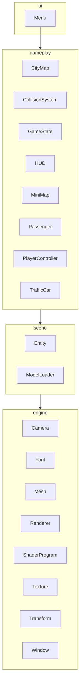
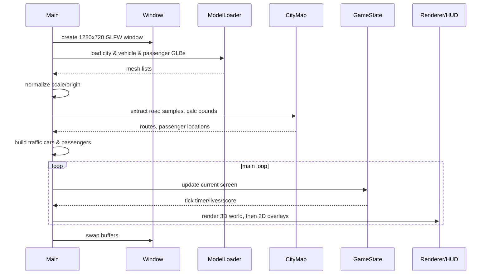
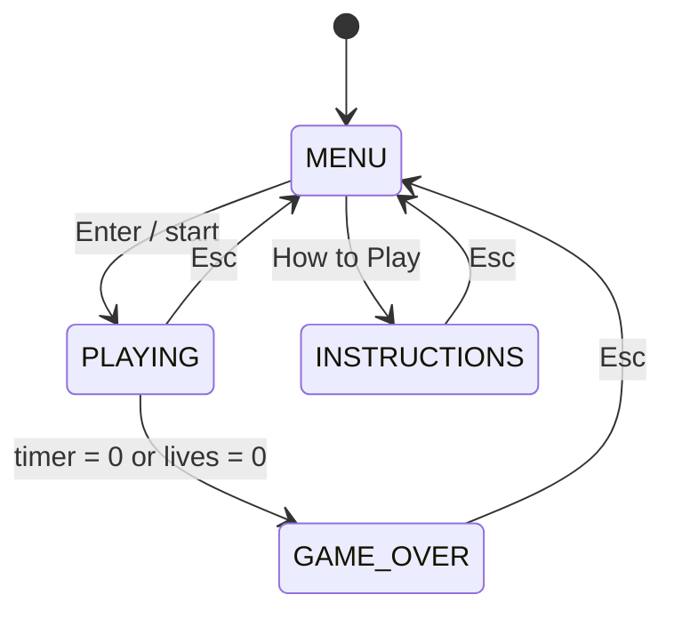
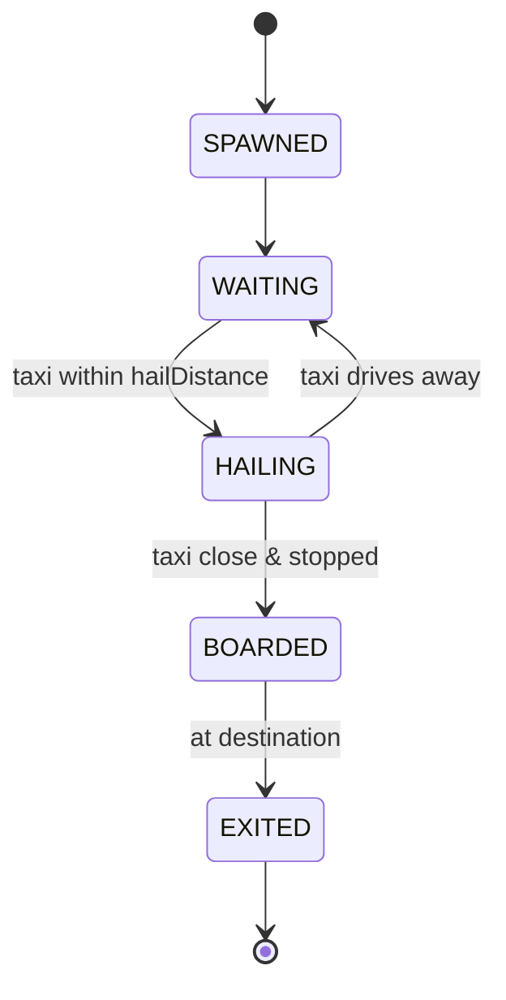

# City Racer

[](https://openjdk.org/projects/jdk/)
[](https://www.lwjgl.org/)
[](https://www.opengl.org/)
[](https://github.com/JOML-CI/JOML)
[]()
[](https://maven.apache.org/)
[]()

[](https://github.com/PSLSbb/gamegame)
[](https://github.com/PSLSbb/gamegame)
[](https://github.com/PSLSbb/gamegame/search?l=Java)
[](https://github.com/PSLSbb/gamegame/issues)

City Racer is a Java/LWJGL passenger-delivery driving game. The player drives a van through a loaded 3D city map, picks up passengers at green markers, drops them off at yellow markers, avoids traffic cars, and tries to score as many deliveries as possible before time or lives run out.

The project is intentionally compact: it has a small custom rendering/gameplay stack, GLB model loading through Assimp, arcade-style vehicle movement, generated traffic routes, passenger objectives, a HUD, and a minimap.

## Contents

- [Features](#features)
- [Badges](#badges)
- [Requirements](#requirements)
- [Project Structure](#project-structure)
- [Architecture Overview](#architecture-overview)
- [Runtime Flow](#runtime-flow)
- [Game State Machine](#game-state-machine)
- [Passenger State Machine](#passenger-state-machine)
- [Bundled Assets](#bundled-assets)
- [Quick Start](#quick-start)
- [How to Play](#how-to-play)
- [Build and Run Commands](#build-and-run-commands)
- [Core Systems](#core-systems)
- [Asset and Model Pipeline](#asset-and-model-pipeline)
- [Rendering and Shaders](#rendering-and-shaders)
- [Gameplay Tuning Guide](#gameplay-tuning-guide)
- [Adding or Changing Content](#adding-or-changing-content)
- [Troubleshooting](#troubleshooting)
- [Development Notes](#development-notes)
- [Suggested Next Improvements](#suggested-next-improvements)
- [Related Documents](#related-documents)

## Features

- 3D city driving using LWJGL 3, GLFW, OpenGL 3.3, JOML, STB, and Assimp.
- GLB model loading for the city map, player vehicle, traffic vehicles, and passengers.
- Passenger pickup and drop-off gameplay.
- Five-minute game timer.
- Three-life collision system.
- Traffic cars following generated routes.
- Third-person chase camera.
- HUD with score, timer, speed, lives, delivery count, and passenger hints.
- Minimap with road samples, traffic routes, player direction, passengers, traffic, and spawn location.
- Menu, instructions screen, scoreboard, and game-over screen.
- Fallback city/car generation if a model fails to load.

## Badges

| Badge | Meaning |
| --- | --- |
| `Java 26` | Compiler target (`maven.compiler.source/target` in `pom.xml`) |
| `LWJGL 3.3.6` | LWJGL version pinned in `pom.xml` |
| `OpenGL 3.3 Core` | GLFW/OpenGL context requested by the engine |
| `JOML 1.10.x` | JOML math library dependency |
| `GLFW 3.3` | GLFW window/input dependency (pulled in via LWJGL) |
| `Maven` | Build tool |
| `Linux` | Current LWJGL natives classifier |
| `repo size`, `last commit`, `top language`, `open issues` | Live GitHub stats |

## Requirements

The Maven project is configured for:

- JDK 26 or newer, based on `maven.compiler.source` and `maven.compiler.target` in `pom.xml`.
- Maven 3.8+.
- Linux native LWJGL libraries, because `pom.xml` sets:

```xml
<lwjgl.natives>natives-linux</lwjgl.natives>
```

- A graphics environment that supports OpenGL 3.3 Core Profile.
- A desktop display session for GLFW. Headless terminals usually cannot run the game window without extra display setup.

For Windows or macOS, update the `lwjgl.natives` property in `pom.xml` to the matching LWJGL classifier, such as `natives-windows` or `natives-macos`.

## Project Structure

```text
.
|-- pom.xml
|-- source/                          # City map GLB asset
|   `-- burnin_rubber_crash_n_burn_city.glb
|-- 1982_toyota_hiace_combi.glb      # Player vehicle GLB asset
|-- bmw_m4_competition_m_package.glb # Traffic vehicle GLB asset
|-- assets/
|   `-- passengers/
|       |-- ATTRIBUTION.txt
|       `-- passenger.glb            # Bundled CesiumMan character (CC-BY 4.0)
|-- textures/                        # Extracted embedded GLTF textures
|   |-- gltf_embedded_0.png ...
|   `-- gltf_embedded_8.png
|-- src/main/java/game
|   |-- Main.java
|   |-- core                         # Shared object contracts
|   |   |-- GameObject.java
|   |   |-- Renderable.java
|   |   `-- Updatable.java
|   |-- engine
|   |   |-- Camera.java
|   |   |-- Font.java
|   |   |-- Mesh.java
|   |   |-- Renderer.java
|   |   |-- ShaderProgram.java
|   |   |-- Texture.java
|   |   |-- Transform.java
|   |   `-- Window.java
|   |-- gameplay
|   |   |-- CityMap.java
|   |   |-- CollisionSystem.java
|   |   |-- GameState.java
|   |   |-- HUD.java
|   |   |-- MiniMap.java
|   |   |-- Passenger.java
|   |   |-- PlayerController.java
|   |   |-- ScoreEntry.java            # Deprecated alias for game.scoring.ScoreEntry
|   |   |-- ScoreboardManager.java     # Deprecated alias for game.scoring.ScoreboardManager
|   |   `-- TrafficCar.java
|   |-- scene
|   |   |-- Entity.java
|   |   `-- ModelLoader.java
|   |-- scoring
|   |   |-- ScoreEntry.java
|   |   |-- Scoreboard.java
|   |   `-- ScoreboardManager.java
|   `-- ui
|       `-- Menu.java
|-- src/main/resources/shaders
|   |-- fragment.glsl
|   |-- menu_fragment.glsl
|   |-- menu_vertex.glsl
|   `-- vertex.glsl
`-- target/  (generated build output, do not edit)
```

## Architecture Overview

`game.Main` is the application coordinator. It creates the window, renderer, camera, game state, gameplay systems, models, entities, input callbacks, and main loop.

The code is layered so higher layers depend only on lower ones:



## Runtime Flow



## Game State Machine

The top-level screen flow is driven by `GameState.GameScreen` (`MENU`, `PLAYING`, `GAME_OVER`). The instructions screen is a sub-view of `MENU` toggled by `showInstructions`:



Scores earned in `PLAYING` are persisted through the `scoring` package (`ScoreboardManager`).

## Passenger State Machine

Each passenger follows a full pickup/drop-off lifecycle:



- Key distances in `Passenger.java`: `hailDistance` `8.0f`, `boardingDistance` `2.0f`, `destinationArrivalDistance` `6.0f`. Legacy 2D radii map to these: `pickupRadius` `5.0f`, `dropoffRadius` `6.0f`.

## Bundled Assets

The project ships the following GLB models:

| Asset | Path | Size | Role | Attribution |
| --- | --- | --- | --- | --- |
| City map | `source/burnin_rubber_crash_n_burn_city.glb` | ~18 MB | City/map world geometry | Burnin' Rubber providers |
| Player vehicle | `1982_toyota_hiace_combi.glb` | ~32 MB | Player car | Original asset author |
| Traffic vehicle | `bmw_m4_competition_m_package.glb` | ~22 MB | Traffic car mesh clones | Original asset author |
| Passenger | `assets/passengers/passenger.glb` | ~0.5 MB | Pickup/drop-off character | Cesium (CC-BY 4.0) |

Embedded textures extracted from models at build time land in `textures/` (`gltf_embedded_0.png ... gltf_embedded_8.png`).

Also bundled: `assets/passengers/ATTRIBUTION.txt` documenting the Cesium passenger model license.

## Quick Start

From the repository root:

```bash
mvn package && java -jar target/city-racer-new-variation-ref-1.0.jar
```

During the first Maven build, dependencies may need to be downloaded from Maven Central. The shaded jar is configured with `game.Main` as the entry point.

## How to Play

Objective:

- Drive through the city.
- Find passengers at green pickup markers.
- Drive to the active passenger's yellow drop-off marker.
- Avoid traffic cars.
- Keep the car within the city bounds.
- Deliver as many passengers as possible before the timer expires or lives reach zero.

Controls:

| Action | Keys |
| --- | --- |
| Accelerate | `W` or `Up Arrow` |
| Brake / reverse | `S` or `Down Arrow` |
| Turn left | `A` or `Left Arrow` |
| Turn right | `D` or `Right Arrow` |
| Navigate menu | `Up Arrow`, `Down Arrow` |
| Select menu item | `Enter` |
| Return to menu / close instructions | `Esc` |

Rules:

- Each delivered passenger is worth 100 points.
- The timer starts at five minutes and the player has three lives.
- Hitting traffic costs one life and returns the player to the spawn point.
- The game ends when the timer reaches zero or lives reach zero.

HUD:

- Top left: score. Top center: remaining time. Top right: speed in km/h.
- Bottom left: lives. Left side: delivery count.
- Center notification: nearest passenger or current drop-off objective.
- Minimap: road samples, traffic, player direction, passengers, and spawn point.
- Main menu exposes a scoreboard of the top five scores (via `ScoreboardManager`).

## Build and Run Commands

Compile:

```bash
mvn compile
```

Package a runnable shaded jar:

```bash
mvn package
```

Run the packaged game:

```bash
java -jar target/city-racer-new-variation-ref-1.0.jar
```

Run from compiled classes with Maven-managed dependencies:

```bash
mvn exec:java -Dexec.mainClass=game.Main
```

The project does not currently define tests. If tests are added later, run them with:

```bash
mvn test
```

## Core Systems

### Main Loop

The main loop in `Main.loop()` calculates `deltaTime`, polls window events, starts a new render frame, updates the active screen, and swaps buffers. `deltaTime` is capped to `0.05f` seconds to keep physics stable.

```java
float deltaTime = (now - lastTime) / 1_000_000_000.0f;
if (deltaTime > 0.05f) deltaTime = 0.05f;
```

### Screen State

`GameState.GameScreen` has three states: `MENU`, `PLAYING`, `GAME_OVER`. The menu handles start, instructions, scoreboard, and quit.

### Player Movement

`PlayerController` implements arcade driving (acceleration `12.0f`, max speed `30.0f`, reverse limit `40%`, braking `8.0f`, turn speed `2.5f`, friction `4.0f`). The camera follows behind and above the car with smoothing.

### Traffic

Traffic is split into two groups in `Main.createTraffic()`:

- **Interactive traffic**: up to `INTERACTIVE_TRAFFIC_COUNT` (10) cars that follow generated routes, each driven toward the next waypoint. Speed per car is `4.5f + (i % 5) * 0.8f`.
- **Ambient traffic**: `AMBIENT_TRAFFIC_COUNT` (38) simplified cars that also follow routes, with speed `3.0f + (i % 9) * 0.35f`.

Counts are bounded by available routes:

```java
int interactiveCount = Math.min(INTERACTIVE_TRAFFIC_COUNT, Math.max(4, routes.size()));
int totalTraffic = interactiveCount + AMBIENT_TRAFFIC_COUNT;
```

### Collisions

- City bounds: player position clamped to calculated bounds.
- Buildings: solid mesh edges push the player away.
- Traffic: contact within two car radii costs a life and respawns the player. A two-second crash cooldown prevents repeat collisions.

## Asset and Model Pipeline

The project uses five packaged GLB assets. `pom.xml` includes `*.glb` and `*.gltf` resources. `ModelLoader.resolveModelPath()` searches: the given path, the working directory, parent project directories, and packaged resources (copied to a temp file for Assimp).

### City Model Processing

`Main.createCityScene()` normalizes bounds, shifts the center, estimates ground height from road-ish meshes (`street`, `parking`, `crosses`, `bridge`, `tunnel`), and scales to gameplay space. Collision and invisible meshes are skipped for rendering.

### Car Model Processing

`Main.createPlayerCar()` centers the mesh origin, seats the bottom at ground level, rescales the length to about `4.5f` units, and applies a `PI` yaw offset so the nose faces forward.

## Rendering and Shaders

- 3D world shader: `src/main/resources/shaders/vertex.glsl` + `fragment.glsl`.
- 2D UI/menu shader: `src/main/resources/shaders/menu_vertex.glsl` + `menu_fragment.glsl`.

3D rendering uses depth testing, opaque-then-transparent ordering, and a simple directional light with ambient, diffuse, and specular components. 2D rendering uses an orthographic 1280x720 projection for text, rectangles, lines, and diamonds. `Renderer` falls back to placeholder blocks when no system font is found.

## Gameplay Tuning Guide

| Goal | File | Values to edit |
| --- | --- | --- |
| Change game time | `src/main/java/game/gameplay/GameState.java` | `timeLimit` |
| Change player lives | `src/main/java/game/gameplay/GameState.java` | `lives`, `startGame()` |
| Change score per delivery | `src/main/java/game/gameplay/GameState.java` | `deliverPassenger()` |
| Change car physics | `src/main/java/game/gameplay/PlayerController.java` | `acceleration`, `maxSpeed`, `braking`, `turnSpeed`, `friction` |
| Change pickup/drop-off radius | `src/main/java/game/gameplay/Passenger.java` | `pickupRadius`, `dropoffRadius` |
| Change traffic count/speed | `src/main/java/game/Main.java` | `INTERACTIVE_TRAFFIC_COUNT`, `AMBIENT_TRAFFIC_COUNT`, speeds in `createTraffic()` |
| Change collision size | `src/main/java/game/gameplay/CollisionSystem.java` | `carCollisionRadius`, `buildingCollisionRadius` |
| Change crash cooldown | `src/main/java/game/Main.java` | `CRASH_COOLDOWN_SECONDS` |
| Change camera sampling | `src/main/java/game/engine/Camera.java` | `distance`, `height`, `lookHeight` |
| Change HUD/minimap layout | `src/main/java/game/gameplay/HUD.java`, `MiniMap.java` | draw coordinates and colors |
| Change menu text | `src/main/java/game/ui/Menu.java` | menu/instruction strings |

## Adding or Changing Content

### Replace a Vehicle

1. Drop a new `.glb`/`.gltf` in the repository root.
2. Update `CAR_MODEL_PATH` / `TRAFFIC_CAR_MODEL_PATH` in `Main.java`.
3. `mvn package`, then check appearance, orientation (`CAR_MODEL_YAW_OFFSET`), and scale/roof placement.

### Replace the City Map

1. Add the city `.glb`/`.gltf`.
2. Update `CITY_MODEL_PATH` in `Main.java`.
3. Name road meshes with road-like words (`street`, `parking`, `crosses`, `bridge`, `tunnel`) and buildings with `building`.
4. Watch startup logs for loaded mesh count, bounds, and road sample count.

### Add a Passenger

Edit `CityMap.generateRoadSamplePassengerLocations()` (or `generatePassengerLocations()` if no road samples). Each passenger needs pickup/drop-off `Vector2f` coordinates plus a name.

### Add Traffic Routes

Routes are lists of `Vector2f` waypoints produced by `CityMap.generateRoutes()` / `CityMap.generateRoadSampleRoutes()`. `TrafficCar` loops waypoints and wraps around.

### Add a New HUD Element

1. Add data to `GameState`.
2. Pass it to `HUD.render(...)`.
3. Draw via `renderer.drawText`, `renderer.drawRect`, `renderer.drawLine`, or `renderer.drawDiamond`.

### Add a New Shader Uniform

1. Declare it in the GLSL shader.
2. Add a setter call in `Renderer`, with a helper in `ShaderProgram` if needed.

## Troubleshooting

### `Unsupported class file major version` or compile failure

Install JDK 26 or lower the `maven.compiler.source`/`maven.compiler.target` in `pom.xml`.

### LWJGL native library errors

This project targets `natives-linux`. Change the `lwjgl.natives` property for your OS.

### Window does not open

Check for a desktop display session, OpenGL 3.3 Core support, and that GLFW is well-initialized; headless or SSH sessions usually cannot open the window.

### Models do not load

The `mvn package` run must include the GLB/GLTF resources. Verify `CAR_MODEL_PATH`, `CITY_MODEL_PATH`, `TRAFFIC_CAR_MODEL_PATH`, `PASSENGER_MODEL_PATH` match file paths. Startup logs show whether Assimp reported an import error. The project falls back to placeholder geometry.

### Car spawns in a strange place

Spawn placement depends on detected road geometry. Ensure road meshes are named with road-like words and kept mostly horizontal.

### Building collisions do not work

`CollisionSystem.isSolidCityMesh()` only treats meshes whose name contains `building` as solid. Rename meshes or adjust the predicate.

### Road height is wrong

Road height sampling relies on road-like mesh names and horizontal triangles. Avoid marking road meshes `collision` or `invisible` for some sampling paths.

### Text appears as blocks

The system font loader could not find a font. Install a common font from `Renderer`'s path list or update the list.

## Development Notes

- No GUI console required at runtime (window renders for the game), but the run environment needs OpenGL + GLFW.
- The codebase currently has no automated test suite; `mvn test` is safe to run but exits with no tests.
- Window size is fixed at 1280x720; HUD/menu/minimap coordinates are hard-coded for it.
- This is a small custom engine, not a full framework.
- Build outputs go to `target/`; `dependency-reduced-pom.xml` is generated by the Shade plugin.
- Score persistence currently writes to `scoreboard.txt`.
- Scores also exist in `scoring/` (`Scoreboard.java` central manager).

## Suggested Next Improvements

- Add Maven profiles for Linux, Windows, and macOS LWJGL natives.
- Add a resize-aware renderer and HUD layout.
- Add sound effects for pickup, delivery, collision, and menu navigation.
- Add unit tests for `CityMap`, `Passenger`, `GameState`, routes, and scoring.
- Add debug toggles for road samples, city bounds, collision bounds, and route lines.
- Add a pause screen instead of returning straight to the menu on `Esc`.
- Credit the non-Cesium assets authors in `assets/` next to their files.

## Related Documents

- `MARIA_DESIGN_DIAGRAM.md` — proposed relational (MariaDB) schema mapping the game's runtime design.